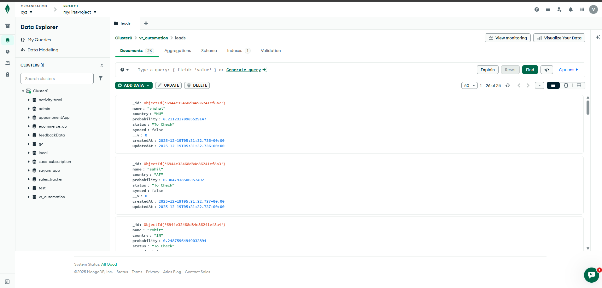

# Smart Lead Automation System

A simple full-stack application that takes a list of names, predicts their most likely nationality using an external API, verifies leads based on confidence, and automatically syncs verified leads using a background job.

---

## 🚀 Features

- Submit multiple names at once
- Fetch nationality predictions from **Nationalize.io**
- Automatically classify leads:

  - **Verified** → probability > 0.6
  - **To Check** → probability ≤ 0.6

- Persist results in database
- Background job runs every 5 minutes to sync verified leads
- Idempotent sync (each lead is synced **only once**)
- Simple React + TypeScript frontend

---

## 🧱 Tech Stack

### Frontend

- React
- TypeScript
- Vite
- Tailwind CSS
- Axios

### Backend

- Node.js
- Express
- MongoDB + Mongoose
- Node-cron
- Axios

---

## 🏗️ High-Level Architecture

```
[ React UI ]
     |
     v
[ Express API ]
     |
     v
[ Nationalize.io API ]
     |
     v
[ MongoDB ]
     |
     v
[ Cron Job (every 5 min) ]
```

---

## 🔄 Application Flow

1. User enters names in the frontend UI
2. Frontend sends names to backend API
3. Backend:

   - Calls Nationalize.io for each name
   - Picks the country with the highest probability
   - Applies business rule:

     - probability > 0.6 → Verified
     - probability ≤ 0.6 → To Check

4. Lead data is saved in the database with `synced = false`
5. A background cron job runs every 5 minutes:

   - Finds all leads where `status = Verified` and `synced = false`
   - Prints a console message simulating CRM sync
   - Marks the lead as `synced = true`

---

## ✅ Business Rules

| Condition         | Status   |
| ----------------- | -------- |
| probability > 0.6 | Verified |
| probability ≤ 0.6 | To Check |

---

## 🔁 Idempotency Strategy

To ensure verified leads are **never synced more than once**:

- Each lead has a `synced` boolean flag
- The cron job only processes:

  ```js
  { status: "Verified", synced: false }
  ```

- After syncing, the lead is updated to:

  ```js
  synced = true;
  ```

This guarantees idempotency even if:

- The cron job runs multiple times
- The server restarts

---

## ⏱ Background Job

- Runs every **5 minutes**
- Implemented using `node-cron`
- Sync behavior is simulated using server console logs:

  ```
  [CRM Sync] Sending verified lead Ravi to Sales Team...
  ```

No real CRM integration is required.

---

## 📦 API Endpoints

### Create Leads

**POST** `/api/lead`

```json
{
  "names": ["Peter", "Aditi", "Ravi"]
}
```

**Response**

```json
[
  {
    "_id": "...",
    "name": "Ravi",
    "country": "IN",
    "probability": 0.88,
    "status": "Verified",
    "synced": false
  }
]
```

---

## 🖥 Frontend Features

- Comma-separated name input
- Submit button with loading state
- Results table
- Filter by:

  - All
  - Verified
  - To Check

The UI is intentionally minimal, focusing on functionality over design.

---

## 🛠️ Setup Instructions

### Backend

```bash
cd backend
npm install
npm run dev
```

### Frontend

```bash
cd frontend
npm install
npm run dev
```

Make sure MongoDB is running locally.

---

## 📌 Notes

- UI does **not** show sync status or logs
- Syncing is handled entirely in the backend
- Console logs simulate CRM integration as required

---

## 📸 Screenshot



## ✅ Summary

This project demonstrates:

- Async API handling
- Clean separation of frontend and backend
- Background automation
- Idempotent processing
- Practical business rule implementation
